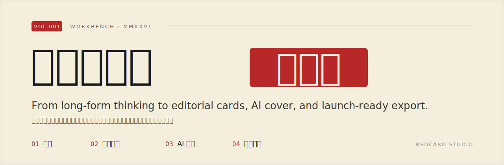

<div align="center">



# RedCard Studio

**一段文案出全套小红书图文，张张有审美，越用越像你**


</div>

---

## ✨ 这是什么

RedCard Studio 是一个本地优先的小红书图文工作台。你丢进一段文字，逐字稿、灵感、播客文稿都行，它先帮你理成符合小红书风格的长文，再自动切成 3:4 的图文卡片，配上一张 AI 封面，最后把图片和发布文案一起打包导出。

数据只存在你浏览器本地，模型调用走你自己的 Claude 或 OpenAI 兼容接口，API Key 不出本地。纯前端，没有后端。

## ⭐ 三大特色

### 🪄 省心

丢进一段文字就能跑完整套，文案、3:4 卡片、封面一次做出来，图片连同发布文案打包导出。中间不用在 ChatGPT、设计工具、排版软件之间来回切。

### 🎨 审美高级

卡片和封面是有审美的，配色、留白、字体这些都照着小红书爆款的视觉来做，封面更接近杂志和海报的版面感。多数时候出来就能直接发，不太用回炉重做。

### 🧬 风格可沉淀

你定的写作规则、说话语气、封面偏好都会存成一份知识库，跟着项目走。用得越久，它越熟悉你这套调性，省得每次从头教一遍。

## 🎯 它解决什么

大多数 AI 图文工具都是一次性的，这回好看了，下回换个题目还得从头折腾，它记不住你的偏好。

还有一个更隐蔽的问题，藏在生成质量里。让模型给自己的产出打分，它几乎篇篇高分，可换上一套独立的评审标准再看，通过率立刻掉一截。RedCard 早期版本也栽在这里，API 一次直出的东西，跟你在对话框里反复调出来的水平差得肉眼可见。

为了补上这个差距，RedCard 做了一轮系统校准：

- **lint 质量门禁**，产出先过一遍硬性检查再放出来
- **few-shot 范例注入**，范例直接用你自己发过的文章
- **Ralph Wiggum 自审循环**，让模型按独立标准回头改自己的稿
- **完整风格 skill 注入到 system message**，把对话里那套手感带进 API 链路

校准想做的就一件事，让 API 直接出的结果，尽量接近你手动调到满意的样子。

## 🧩 四步工作流

| 步骤 | 你给它 | 它产出 |
| --- | --- | --- |
| **1. 长文** | 一段乱素材 | 符合账号语气的长文，带写作规则注入和 AI 腔检测 |
| **2. 文字卡片** | 上一步的长文 | 自动分页的 3:4 图文卡片，可一键重排 |
| **3. AI 封面** | 你定的配色和构图规则 | 整张封面海报，头像、账号名后处理合成 |
| **4. 导出发布** | 一键 | 封面加卡片打包为 ZIP，并生成 200 字内的发布文案 |

长文那一步的写作质量检查（AI 腔检测、写作规则校验），用的是 **dontbesilent** 的 check skill。

## 🚀 快速开始

需要 Node.js 18 及以上版本。

```bash
# 克隆仓库
git clone https://github.com/<your-username>/redcard-studio.git
cd redcard-studio

# 安装依赖
npm install

# 启动开发服务器
npm run dev
```

打开浏览器访问终端里给出的本地地址（默认 http://localhost:5177），在设置里填入你的中转地址和 API Key，就能开始。

构建生产版本：

```bash
npm run build      # 打包到 dist/
npm run preview    # 本地预览构建产物
```

## 🔑 配置模型

RedCard 不内置任何模型，调用走你自己的 Key。

- 在应用内的设置面板填入中转地址和 API Key
- 兼容 Claude 和 OpenAI 兼容接口
- Key 只存在浏览器本地，不上传、不经过任何中间服务器

## 👤 适合谁用

- 在小红书持续做图文、想长期保持稳定调性的个人创作者
- 不想在写作、设计、排版工具之间来回搬运的人
- 已经有自己的写作风格、希望工具能记住它的作者
- 在意数据隐私，不愿意把素材传到第三方服务器的人

## 🛠 技术栈

- **React 19** + **TypeScript**
- **Vite 6**
- **IndexedDB** 本地存储，项目数据不出浏览器
- 纯前端，无后端，无服务器

## 🙏 致谢

长文的 check skill 来自 **dontbesilent**。

## 🤝 贡献

欢迎 Issue 和 PR。有想加的功能、或者踩到 bug，开个 Issue 说一声就行。

## 📄 License

[MIT](LICENSE)
